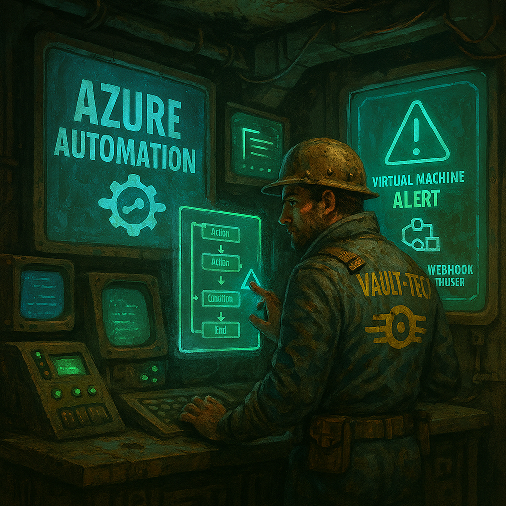

# Azure Automation Overview



> **What is Azure Automation?**  

Azure Automation is a **cloud-based process automation and configuration service** that helps you reduce manual tasks and simplify cloud and on-premises management.  

Core capabilities include:  

- **Runbooks** (PowerShell / Python) for task automation  
- **Desired State Configuration (DSC)** for system consistency  
- **Update Management Center (UMC)** for VM patching (supersedes classic Update Mgmt.)  
- **Change Tracking & Inventory** (files, registry, software, services)  
- **Hybrid Runbook Workers** to run jobs on-prem or in other clouds  
- **Integration with Azure Monitor & Graph API** for event-driven automation  

---

## What's in this repo

| Path | What it is |
| ---- | ---------- |
| [scripts/01-Demo-HelloWorld-Runbook.ps1](scripts/01-Demo-HelloWorld-Runbook.ps1) | Smoke test — proves a new Automation Account runs jobs |
| [scripts/02-Demo-ManagedIdentity-StartStopVMs.ps1](scripts/02-Demo-ManagedIdentity-StartStopVMs.ps1) | Start/stop VMs by tag using a Managed Identity |
| [scripts/03-Demo-Webhook-Runbook.ps1](scripts/03-Demo-Webhook-Runbook.ps1) | Runbook that receives a webhook payload |
| [scripts/04-Demo-Webhook-Trigger.ps1](scripts/04-Demo-Webhook-Trigger.ps1) | Client script that fires the webhook |
| [scripts/05-Demo-HybridWorker-Runbook.ps1](scripts/05-Demo-HybridWorker-Runbook.ps1) | Inventory + internal connectivity test, run on a Hybrid Worker |
| [scripts/06-Setup-AutomationAccount.ps1](scripts/06-Setup-AutomationAccount.ps1) | Builds the whole lab: account, identity, RBAC, runbooks, schedule, webhook |
| [scripts/07-Setup-HybridWorker.ps1](scripts/07-Setup-HybridWorker.ps1) | Onboards an Azure VM or Arc-enabled server as a Hybrid Worker |
| [workbooks/Runbook-Monitoring.workbook.json](workbooks/Runbook-Monitoring.workbook.json) | Azure Monitor workbook for job monitoring |
| [workbooks/Monitor-Workbook-Setup-Guide.md](workbooks/Monitor-Workbook-Setup-Guide.md) | Step-by-step guide for deploying that workbook |

Every script carries full comment-based help — run `Get-Help .\script.ps1 -Full` for parameters and examples.

---

## Pre-requisites

- An **Azure Subscription**  
- **Permissions**:
  - *Owner* or *Contributor* (initial setup)  
  - Use **Automation Contributor** or **Automation Operator** for scoped access  
- **System-Managed Identity** for Graph API / Azure resource access  
- **Log Analytics workspace** (if you want monitoring, reporting, change tracking, or update mgmt.)  

---

## Pricing

| Resource            | Pricing Example                               |
| ------------------- | --------------------------------------------- |
| **Job Runtime**     | First 500 mins free/month, then ~\$0.002/min  |
| **DSC Nodes**       | ~\$6/node/month                               |
| **Update Mgmt.**    | Now included via Update Mgmt. Center (free, but LA costs apply) |
| **Log Analytics**   | ~\$2.76/GB (UK South pricing)                 |
| **Hybrid Workers**  | Your VM costs (on-prem or cloud-hosted)       |

> 🔹 Tip: Always factor **Log Analytics ingestion** into cost estimates—it’s often the biggest contributor.

---

## Permissions Model

| Task                         | Role Required                   |
| ----------------------------- | ------------------------------- |
| Create Automation Account     | Owner / Contributor             |
| Author / Edit Runbooks        | Automation Contributor          |
| View Job Status / Outputs     | Reader / Monitoring Reader      |
| Start / Stop Jobs             | Automation Operator             |
| Hybrid Worker Setup           | VM Admin + Automation Admin     |
| Manage Update Management      | Automation Contributor + LA roles |

---

## Setting up Azure Automation

1. **Create an Automation Account** in the desired region  
2. **Enable System-Managed Identity** and assign RBAC/Graph API permissions  
   - [Grant Graph API permissions via PowerShell](https://github.com/MG-Cloudflow/MSGraph-Examples/blob/main/Managed-Identity/GrandGraphApiPermissionV2.ps1)  
3. **Link to Log Analytics** for job logs, monitoring, and reporting  
4. **Import Modules** (Az, Graph, Intune, Microsoft365DSC, etc.)  
5. **Author Runbooks** (PowerShell, Python, Graphical, or Hybrid Worker)  
   - Import from GitHub, Storage, or write directly in the editor  
6. **Test and Publish Runbooks**, then schedule or trigger via webhook  

---

## Types of Runbooks

| Runbook Type     | Language     | Notes                                                         |
| ---------------- | ------------ | ------------------------------------------------------------- |
| **PowerShell**   | PS 5.1 / 7.2 | Most widely used; Az + Graph modules supported                |
| **Python**       | 2.7 / 3.8    | Ideal for DevOps/data/ML tasks (3.10 coming soon)             |
| **Graphical**    | Drag/Drop    | No-code editor for visual workflows                           |
| **Hybrid**       | PS/Python    | Runs on-prem or other cloud VMs via Hybrid Worker             |
| **Webhook**      | HTTP/JSON    | Trigger from apps, Power Automate, or external systems        |
| **Scheduled**    | N/A          | Time-based automation (cron-like)                            |
| **Event-driven** | N/A          | Triggered by Azure Monitor alerts, Resource Events, or Graph  |

---

## Real-world Scenarios

| Scenario                        | Description                                               |
| ------------------------------- | --------------------------------------------------------- |
| **Intune Device Compliance**    | Use Graph API to audit & alert on compliance states        |
| **Entra Group Governance**      | Auto-check group sizes, email/report if over threshold     |
| **VM Patching**                 | Automate update schedules across mixed Azure/on-prem VMs   |
| **Backup / Archival**           | Export logs/reports to Azure Blob or SharePoint            |
| **Intune Policy Deployment**    | Push JSON templates with detection/remediation scripts     |
| **Lifecycle Cleanup**           | Remove stale users/devices in Entra ID or Intune           |
| **Security Automation**         | Isolate non-compliant devices, enforce policy via Graph    |

---

## Hybrid Worker Group Setup (On-Prem / Cloud)

1. Prepare a **Windows Server 2016+ or Linux VM**  
2. Install the **Hybrid Worker Agent** via script or portal  
3. Register with Automation Account  
4. Validate **heartbeat** and job status in the Azure Portal  
5. Use **Hybrid Worker Groups** for load balancing and HA  

---

## Monitoring, Alerts & Reporting

With **Log Analytics + Azure Monitor**, you can:  

- Track job runtimes and outcomes  
- Detect failures and trigger alerts  
- Build custom dashboards in **Power BI** or **Azure Workbooks**  
- Export reports to Storage, Email, or Teams  

**Sample KQL Query:**  

```kusto
AzureDiagnostics
| where ResourceProvider == "MICROSOFT.AUTOMATION"
| where Category == "JobLogs"
| summarize Jobs = dcount(JobId_g) by ResultType, bin(TimeGenerated, 1h)
```

> 🔹 `ResultType` is one of `Started`, `Completed`, `Failed`, `Stopped` or `Suspended`. `JobId_g` correlates every record belonging to a single job run.

---

## Monitoring Runbooks with an Azure Monitor Workbook

Job history in the portal only shows one Automation Account at a time and drops off after 30 days. A **workbook** gives you a single pinnable dashboard across every account and workspace.

This repo ships a ready-made one:

| File | Purpose |
| ---- | ------- |
| [workbooks/Runbook-Monitoring.workbook.json](workbooks/Runbook-Monitoring.workbook.json) | The workbook template — paste into the Advanced Editor or deploy via Bicep |
| [workbooks/Monitor-Workbook-Setup-Guide.md](workbooks/Monitor-Workbook-Setup-Guide.md) | Full walkthrough: diagnostic settings, import, parameters, alerting, troubleshooting |

**What it reports**

| Tile | Answers |
| ---- | ------- |
| Jobs by outcome | How many completed, failed, stopped or suspended? |
| Job outcomes over time | Is the failure rate trending up? |
| Failure rate by runbook | Which runbook is the problem child? |
| Recent error / warning streams | What was the actual error message? |
| Longest running jobs | What's driving my per-minute billing? |
| Sandbox vs Hybrid Worker | Where are jobs actually executing? |

**Quick start**

1. **Turn on diagnostics.** Automation Account → *Monitoring* → **Diagnostic settings** → enable **JobLogs** and **JobStreams** → send to your Log Analytics workspace. Nothing appears in `AzureDiagnostics` until you do this.

   ```powershell
   $aa = Get-AzAutomationAccount -ResourceGroupName 'rg-automation-bootcamp' -Name 'aa-bootcamp'
   $ws = Get-AzOperationalInsightsWorkspace -ResourceGroupName 'rg-monitoring' -Name 'law-bootcamp'

   New-AzDiagnosticSetting -Name 'diag-automation-to-law' `
       -ResourceId  $aa.AutomationAccountId `
       -WorkspaceId $ws.ResourceId `
       -Log @(
           New-AzDiagnosticSettingLogSettingsObject -Category 'JobLogs'    -Enabled $true
           New-AzDiagnosticSettingLogSettingsObject -Category 'JobStreams' -Enabled $true
       )
   ```

2. **Import the workbook.** Portal → **Monitor** → **Workbooks** → **+ New** → **`</>` Advanced Editor** → paste the contents of `Runbook-Monitoring.workbook.json` → **Apply** → **Save**.

3. **Set the pills** at the top: time range, Log Analytics workspace (multi-select), and runbook filter. Save again so they stick.

4. **Pin tiles** to an Azure dashboard, or share the workbook — viewers need `Log Analytics Reader` on the workspace, not just workbook access.

> 🔹 `JobStreams` captures every `Write-Output` line your runbooks emit and is usually the bulk of the ingestion bill. If cost bites, keep `JobLogs` and drop `JobStreams` — you only lose the error-message tile.

**Then alert on it.** A dashboard tells you after you look; an alert tells you straight away. Create a log search alert on:

```kusto
AzureDiagnostics
| where ResourceProvider == "MICROSOFT.AUTOMATION"
| where Category == "JobLogs" and ResultType == "Failed"
| summarize Failures = dcount(JobId_g) by RunbookName_s
```

Fire when `Failures > 0`, evaluated every 5 minutes over a 15-minute window. The action group can even trigger another runbook via webhook — see [scripts/03-Demo-Webhook-Runbook.ps1](scripts/03-Demo-Webhook-Runbook.ps1).

---

## Best Practices

- **Use Managed Identities**: Avoid service principals where possible, reduces secret management.  
- **Modularize Runbooks**: Create reusable runbooks for common tasks (logging, Graph auth, etc.).  
- **Version Control**: Store runbooks in GitHub/Azure Repos and automate import with pipelines.  
- **Monitor Costs**: Track Log Analytics ingestion; optimize queries and retention.  
- **Hybrid Worker HA**: Deploy multiple workers per group for redundancy.  
- **Use Tags & Naming Standards**: Easier to manage at scale and report on usage.  
- **Limit Permissions**: Apply least-privilege RBAC at Automation Account and resource scopes.  
- **Error Handling & Logging**: Always include try/catch and structured logging for jobs.  
- **Test in Sandbox First**: Validate changes in a non-prod Automation Account before rollout.  
- **Update Modules Regularly**: Keep Az/Graph/Intune modules updated to avoid compatibility issues.  

---
